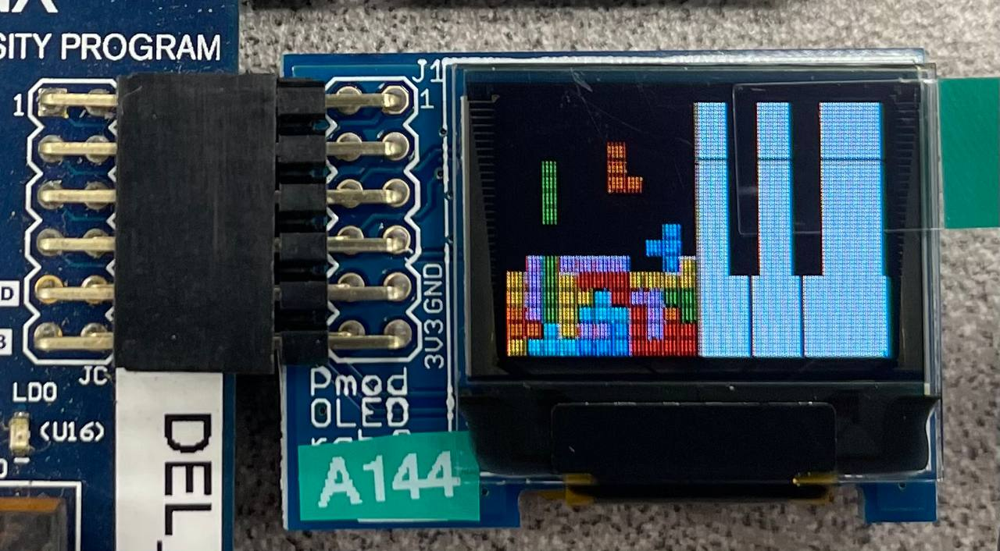
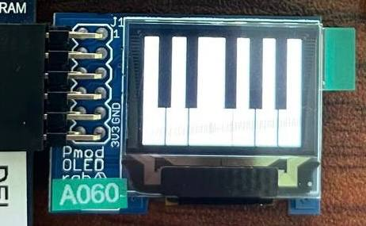
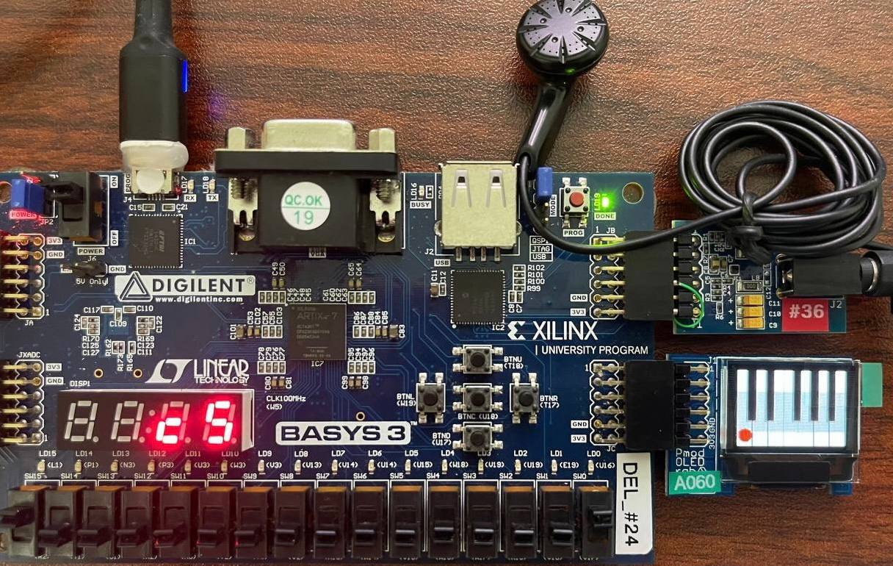
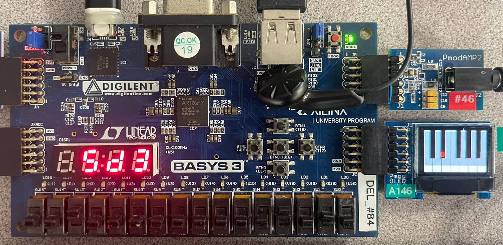
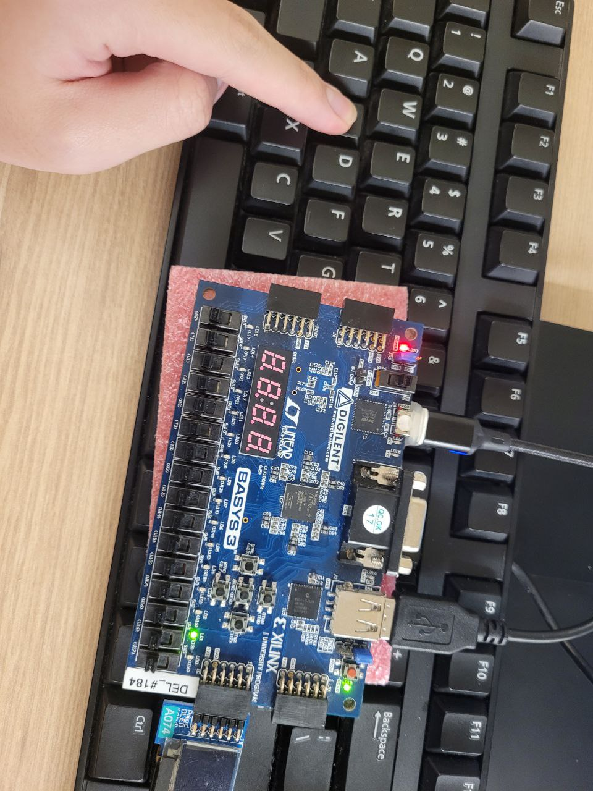
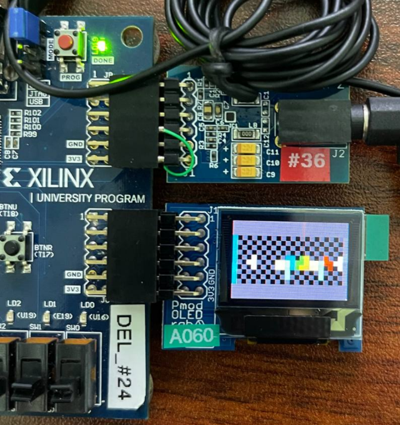

# EE2026: FPGA Two-in-One Entertainment System

**National University of Singapore — EE2026: Digital Design**

A two-in-one entertainment system implemented in Verilog on a Basys 3 FPGA board, featuring a fully playable **Tetris game** and a **Monophonic Synthesizer**, both displayed on OLED screens with PS/2 keyboard input and audio output.

---

## Demo

| Tetris Gameplay (Dual OLED) | Synthesizer |
|---|---|
|  |  |

| Full Setup — Tetris | Full Setup — Synthesizer |
|---|---|
|  |  |

| Next Block Preview | Main Menu |
|---|---|
|  |  |

---

## System Overview

The system boots to a **main menu** where the user selects between two modes using the onboard buttons:

| Button | Action |
|---|---|
| `btnL` | Navigate to Tetris |
| `btnR` | Navigate to Synthesizer |
| `btnC` | Confirm selection |
| `btnD` | Exit / return to main menu |

---

## Features

### Tetris
- Played on a **10×20 grid** rendered on a primary OLED (each grid cell = 4×4 pixels)
- Secondary OLED displays the **next tetrimino** preview
- All **7 tetrimino types** (I, O, L, J, Z, T, S) with full **rotation** — 25 total states
- **Pseudo-random tetrimino generation** via a Linear Congruential Generator
- **Collision detection**: locks piece when it hits the bottom row or a dead block
- **Row clearing**: full rows are cleared and all rows above shift down
- **Game over**: detected when a new piece spawns overlapping dead blocks; screen turns blue
- **Tetris theme song** plays during gameplay
- PS/2 keyboard controls:

| Key | Action |
|---|---|
| `A` | Shift left |
| `D` | Shift right |
| `W` | Rotate clockwise |
| `Space` | Restart game |

### Monophonic Synthesizer
- Supports **3 octaves** (3–5) selected via `sw[13:15]`
- **12 notes** per octave (C, C#, D, D#, E, F, F#, G, G#, A, A#, B) via `sw[0:11]`
- Priority encoding: lowest switch index takes precedence for both octave and note
- **OLED** displays a piano graphic highlighting the active key
- **7-segment display** shows the octave (`AN[0]`), note (`AN[1]`), and sharp indicator (`AN[2]`)
- Audio output via onboard speaker header

---

## Project Structure

```
src/
├── Top_Student.v               # Top-level module (audio instantiation)
├── tetris/
│   ├── tetris_main_test.v      # Tetris top-level: game logic, fall/shift counters
│   ├── tetrimino.v             # All 7 tetrimino shapes and rotation states
│   ├── show_grid.v             # Grid rendering to OLED pixel coordinates
│   ├── block_color.v           # Colour assignment per tetrimino type
│   ├── get_coords.v            # Block coordinate computation
│   ├── oled_to_grid_coords.v   # Primary OLED pixel → grid coordinate mapping
│   ├── oledB_to_grid_coords.v  # Secondary OLED coordinate mapping (next block)
│   ├── pix_to_vertical_rowcol.v# Vertical pixel layout helper
│   ├── T_to_m.v                # Tetrimino-to-memory mapping
│   └── rando.v                 # Pseudo-random number generator (LCG)
├── audio/
│   ├── piano.v                 # Synthesizer top-level: note/octave selection
│   ├── flexibleclock.v         # Parameterised clock divider for arbitrary frequencies
│   ├── c_261hz.v – b_493hz.v   # Individual note frequency generators (octave 4)
│   └── csharp.v … gsharp.v    # Sharp note generators
├── keyboard/
│   ├── PS2_Receive.v           # PS/2 serial protocol receiver
│   ├── keyboard_out.v          # Scan code decoder (make/break code handling)
│   ├── selected_keypress.v     # Maps scan codes to game actions
│   └── own_debouncer.v         # Button/key debouncer
├── display/
│   ├── main_menu.v             # Main menu UI renderer
│   ├── Oled_Display.v          # OLED SPI driver
│   └── flexi_clock.v           # Flexible clock divider for display timing
└── constraints/
    └── Constraint.xdc          # Basys 3 pin constraints (I/O, clock)
```

---

## Hardware

| Component | Details |
|---|---|
| FPGA Board | Digilent Basys 3 (Xilinx Artix-7) |
| Primary Display | Pmod OLED (128×32) — JB port |
| Secondary Display | Pmod OLED (128×32) — JA port (next block preview) |
| Input | PS/2 Keyboard — JC port |
| Audio | Pmod I2S / onboard audio header |
| Controls | Onboard buttons (btnL/R/C/D) + switches sw[0:15] |

---

## Tools

- **Xilinx Vivado** — synthesis, implementation, bitstream generation
- **Verilog HDL** — all design modules
- **Basys 3** — target device (xc7a35tcpg236-1)

---

## References

- OLED image converter: https://github.com/nvbinh15/FPGA-Project-EE2026
- Star Wars / Tetris theme audio: https://github.com/FPGADude/Digital-Design
- Block generation reference: https://github.com/nus-wira/EE2026-FPGA-Project
- PS/2 keyboard: https://github.com/Digilent/Basys-3-Keyboard

---

## Full Report

See [`EE2026_Report.pdf`](EE2026_Report.pdf) for the full project report including individual contributions, implementation details, and test results.
